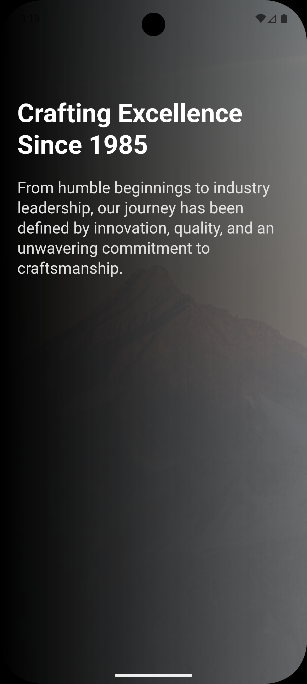

# Ahziyah

An Online Shoes Store app

  <h1>🛍️ Ahziyah</h1>
  
A Modern E-commerce Shoes Store Built with Flutter & Laravel

  
  
  
  
  
  
  

## ✨ Features

- 🎨 Modern and sleek UI design
- 🌙 Light/Dark mode support
- 🔐 Secure authentication system
- 🛒 Shopping cart functionality
- 💳 Payment integration with Paymob
- 🔔 Push notifications
- ❤️ Wishlist management
- 🔍 Advanced product filtering
- 📱 Responsive design for all devices
- 🚀 Smooth animations and transitions

## 🛠️ Tech Stack

- **Framework**: Flutter
- **State Management**: GetX
- **Backend Integration**: REST API with Dio
- **Local Storage**: Hive
- **Push Notifications**: Firebase Cloud Messaging
- **Payment Gateway**: Paymob
- **Animations**: animate_do
- **UI Components**:
  - crystal_navigation_bar
  - flutter_rating_bar
  - cached_network_image
  - flutter_svg

## 📱 Screenshots

  

    
    
    
  

  

    
    
    
  

  

    
    
    
  

  

    
    
    
  

  

    
    
    
  

> Experience the complete shopping journey with our feature-rich mobile application

## 🛠 Getting Started

1. **Clone the repository**

bash
git clone: `https://github.com/OsamaElnagar/ahziyah.git`

2. **Install dependencies**
   bash:
   `flutter pub get`

3. **Run the app**
   bash:
   `flutter run`

## 🏗️ Project Structure

lib/
├── bindings/ # Dependency injection

├── core/ # Core functionality

├── features/ # App features

│ ├── authentication/

│ ├── checkout/

│ ├── discover/

│ ├── home/

│ ├── profile/

│ └── wishlist/

│ └── ........

│ └── ........

│ └── ........

├── services/ # API and local services

├── theme/ # App theming

└── utils/ # Utilities and helpers

## 🔧 Configuration

1. Set up your Firebase project and add `google-services.json` (Android) and `GoogleService-Info.plist` (iOS)
2. Configure your Paymob API keys in the environment variables
3. Update the API endpoints in `lib/utils/app_constants.dart`

## 🤝 Contributing

Contributions are welcome! Please feel free to submit a Pull Request.

1. Fork the repository
2. Create your feature branch (`git checkout -b feature/AmazingFeature`)
3. Commit your changes (`git commit -m 'Add some AmazingFeature'`)
4. Push to the branch (`git push origin feature/AmazingFeature`)
5. Open a Pull Request

## 📧 Contact

Feel free to reach out for collaborations, questions, or just to say hi!

  
  
  
  

## 📝 License

This project is licensed under the MIT License - see the [LICENSE](LICENSE) file for details.

---

  Made with ❤️ by Osama M. Elnagar

